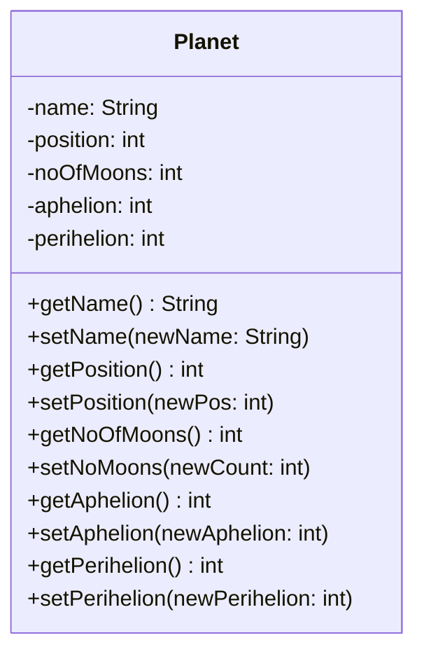
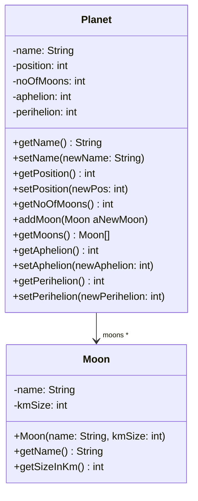
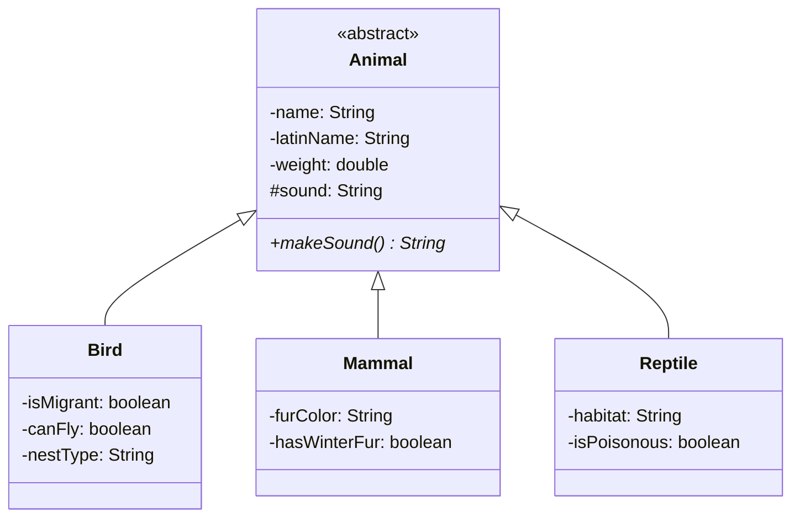
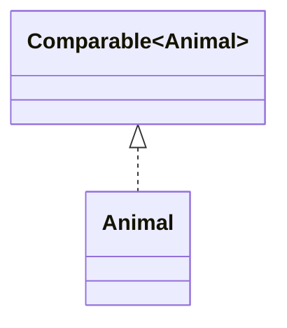

# Assignment 2
This assignment consists of two parts, one programming part and one modelling part.

you can find some additional resources here:
- [Uml Class diagram basic notation](../UMLClassDiagramJava.md)
- [Uml Class diagram relation notation](../UmlClassDiagramRelations.md)


# Assignment 2 - Object Oriented Programming
## Overview

This assignment is about understanding and handling the basics of object orientation in Java. It will contain both coding and modelling to some extent -- all of it should be handed in via gitlab as usual.

You use the generated project to manage the whole assignment.

> Carefully read the assignment rules as defined on Moodle. In brief, do the assignments yourself, hand them in at the deadline and don't cheat.

> Do not hesitate to ask your teaching assistant at the practical meetings (or the teacher at the lectures) if you have any problems. You can also post a question in the Slack channel for the course.

> **Submission:** you submit your solution using git and GitLab following the instructions given for the course.

### A Single Planet
Create a new class in Java to represent a planet in the solar system. Use the class described with UML below as a starting point and add suitable constructors. Make sure the setters only accept reasonable values, watch out for null for objects (the String name). Maybe the name should be at least 2 characters long? Negatives are also not good.



Also create a main program that utilises the class by instantiating into two objects, one for Earth and one for Mars. Information about the planets should then be printed as follows:

```
Earth:
  Position: 3
  Moons: 1
  Aphelion: 152097701 km
  Perihelion: 147098074 km
Mars:
  Position: 4
  Moons: 2
  Aphelion: 249209300 km
  Perihelion: 206669000 km
```

### Planets with Moons
Now create an additional class called **Moon** with a name and a diameter. Each planet should now be able to hold a number of moons. 



**Important:** we encourage you to _rewrite_ a planet class with the same attributes as in the first task in a new package, but with new additions. The motivation for this is that you should get practice in creating classes. It is possible to just "copy-and-paste", but there is also value in repeating the craft of coding.

The additions to the planet class is the possibility to add and show moons (we will not add removing to reduce complexity). Internally, the moon objects should be stored in an **ArrayList** and adding should be done _one moon at a time_, not a complete list.

The method to show the moons should return an _array_ (that is, _not_ an **ArrayList**). The reason for this is to force you into making an as safe method as possible -- you need to make sure that the returned objects are not the same as the ones stored in the planet object.

Lastly, create a main program that shows that your classes work. Use planets that have at least one moon in your code. All values can be hard coded and an example output would be:

```
The planet is called Mars and has the following moons:
  Moon 1 is called Phobos (22km)
  Moon 2 is called Deimos (12km)

The planet is called Earth and has the following moons:
  Moon 1 is called The moon (3474km)
```

### The Animal Kingdom
Begin by creating the inheritance structure found below, where **Animal** is an abstract class with an abstract method called **makeSound()**. This means that all the sub classes need to implement it.



Facts can usually by found on Wikipedia (or similar place), but here are some explanations. In **Bird** there is an attribute called **isMigrant** which defines if the bird migrates during seasons (to warmer countries). For the same class, the attribute **nestType** defines where the bird is making a nest -- in a tree, on the ground, making a hole and so on.

For the **Reptile** the attribute **Habitat** defines where the reptile lives, for example in water, in the desert, in mountains and so on.

Make a small main that shows that the program works -- use correct and actual data. You can set data directly in your program, no need to ask the user for input. Print out some of the data, not the least the sound. Note that the different types of animals has a different way of sounding (saying, tweeting and hizzing). Below is an example of what can be outputted:

```
A Swedish red and white cattle says: Muuuuu!
A Peafowl tweets: Kaka-kaka
A Comodo dragon hizzes: kshhhhhh kshhhh
```

### Order in the Animal Kingdom
In new package, as we want you to re-write the classes for practice, we want you to make the animals comparable. This means that we want you to implement the **Comparable** interface so that the animals can be compared _lexically on the latin name_. 



Store at least six animals in an **ArrayList** and sort it before printing out the latin name as well as: _nest type_ for birds, _fur colour_ for mammals and _habitat_ for reptiles. This means that you need to check each object for which class it belongs before printing out the information. An example print out is shown below:

```
Apteryx mantelli puts its egg in/on a whole in the ground
Bos taurus has a fur that is red and white
Chelonia mydas lives in the sea
Crocodilus niloticus lives in fresh water
Panthera tigris has a fur that is yellow and black
Pavo cristatus puts its egg in/on a whole in the ground
```


# Assignment 2 - Object Oriented Design

This part of the the second assignment is about object oriented design. There is no programming in this part and you will hand in at least one class diagram, one sequence diagram and one object diagram. These diagrams describe your intended design. This assignment links into assignment 3 where you will be presented with a design to the same problem, including working java-code and automatic test cases. You can view the starting point of the third assignment as a suggested solution to this assignment. Therefore, **do not** look at the details of the third assignment until you feel happy with your intended model.

While the goal is to create a design on paper as an exercise note that this is quite hard and the end goal is not that it should be perfect, rather that you should train on thinking in terms of classes and objects and how they collaborate. There is always changes to the design when the design meets the code (reality) but you will be better prepared for these changes if you have thought about the design a bit before diving into the code. As mentioned part of this assignment is also to reflect on your own design compared to a "working" design. Note, you are not graded on how "good" or "correct" your model is. This is probably the first OO-model you are creating so it is better to just do something and try to use the different diagrams as they are supposed to be used, studying and learning.

The final step to pass assignment 3 is to write a report. This report should reflect on the differences between your intended design, and the design in the suggested solution. More about this later.

Hint: As you are to write a reflective report to pass this assignment it is a good idea to make some notes about your own thinking during your work. Simply note what you are doing and WHY, it can greatly help when you reflect on your design at a later stage.

You are encouraged to commit and push the changes you make regularly to your main branch. When you are done with the assignment you create a merge request to the release branch. A teacher/tutor will take a look and approve the merge request, or point out missing items. When your merge request has been approved you have passed the first step of the assignment. You now need to do Assignment 3 and after that you create your reflection report.

## The Monopoly Game
You are to produce a design for a simple monopoly game. If you are not familiar with the game of monopoly can find plenty of overviews online and you will probably get a basic understanding of the game. Remember that we will only use a subset of the game in the assignment, and part of the problem when designing can actually be to keep a limited scope and not do too much (i.e. make an overly complicated design for some imagined future case). Try to limit your design to the task as described below and do not think about future features that could be nice to have.

### The Board
The board will consist of a number of tiles. Tiles can be of different types as described below, and different rules apply when a player stops on or passes over a tile. The tiles are arranged in a circular way. That is, players move from one tile to the next forward (or backward), and when reaching the last tile they start over at the first tile.

The tile types are:
 * Start tile: There is only one start tile. This is the tile where each player starts. When passing over the start tile a player should get 200 additional credits. Not that this does *not* apply the first time, i.e at the game start.
 * Free tile: Nothing happens on a free tile.
 * Property Tile: Property tiles have a street name and a cost. The following rules apply to when a player stops at a property tile. If it is not owned by a player, it can be bought by the player at the start of the next round (i.e. you buy properties before moving) if the player has enough funds. If another player owns the property you pay rent to that player with the amount of 300 credits.

### The Dice
A player moves over the board by rolling two six-sided dice. The player moves the number of tiles equal to the sum of the dice values. If the dice values show the same values, the player will first move the number of steps shown, and then roll both dice again and move. This continues as long as the player dice show the same values. Note that if the player ends up on a free property tile the player can buy this property before rolling the dice again. If the player ends up on another players property rent must be payed before moving on.

### Starting the Game
Each player enters their names and then gets 1000 credits. The players start at the Start Tile. The game begins when the last player has been added and then no further players can join.

### Playing the Game
Starting with the first player, the player can either buy a property (if currently stopped on a free property tile) and finally roll the dice and move. Movement is always the last thing a player does and it is then the next players turn.

### Ending the Game
The game ends after 10 rounds or when one player has become bankrupt (i.e. has zero or less credits). The winner of the game is the player with the most credits.

## The User Interface
The user interface should be a simple console interface. The game board should be visualized with the tiles and where the players are positioned. All game actions should be reported (i.e. how much a player moves, if credits are added or removed from a player, if a property is bought or if the player pays rent, etc.)

The user interface should be encapsulated in it's own class and any input or output should be handled in this class. I.e. no `system.out.print` or `system.in.read` in any other part of the game.

## Computer Player
In a future version it is expected that there will be a computer player. The design should be prepared for this upcoming feature.

## Class diagram
Create a class diagram that shows the structure of the classes with the appropriate relations. The goal is to end up at a design level class diagram, but it is a good idea to create an analysis level diagram first. Feel free to add this analysis level diagram to your submission. Classes should of course be named, have relevant attributes (fields) and operations (methods). You should use relations between the classes such as generalization/specialization (inheritance), realziation, association or dependency, if appropriate and needed.

## Object and Sequence diagram
To test your design you can try to see how it would work (i.e. how should the objects communicate to perform the task at hand) in particular situation. We call such a situation a scenario. Below is one scenario and you should create one object diagram and one sequence diagram for it using your classes.

The object diagram should show what objects and their links before the steps of the scenario is executed (the initial state). I.e. what does the system look like at this particular moment in time.

The sequence diagram show how the objects are used to perform the steps of the scenario, typically by using the objects from the object diagram. However new objects can also be introduced as the sequence diagram shows the dynamic execution of the system and objects can for example be created.

Considering the user interface it is not a central part of the current scenario. If you think there are messages that need to be sent to/from the user interface, an object of this type is likely needed. However, this is very much up to how you have designed your game.

Note that to be able to send a message between two objects there need to be some relation between them in the class diagram (association or dependency). If you find that your structure (class diagram) is lacking when modeling the scenarios, you should of course try to improve the structure. Feel free to add more scenarios that cover other situations.

### Player moves scenario

#### Initial State
The player named "Boris" is currently at a property with street name "Downing Street". Downing Street is the tile before the Start tile (i.e. it is the last tile on the board). After the start tile comes another property tile ("Seven Sisters Road"), after that we have another property tile ("Abbey Road"). The dice currently have the face value 6 and 2.

#### Steps
1. It is now Boris turn and he is offered the dice. 
2. Boris rolls the dice and gets the values 1 and 2.
3. Boris moves from Downing Street, to the Start tile.
4. Boris moves from the start tile to Seven Sisters Road. As Boris has moved over the start tile, he receives 200 credits.
5. Boris moves from Seven Sisters Road to to "Abbey Road". Boris stops at this tile. As the tile is free Boris is offered to buy this property at the start of his next round.

# Model deliverables In the Assignment
You should create one class diagram, one object diagram and one sequence diagram as per the instructions above. The formats for these should be common image formats like png or jpeg (or you can use mermaid markdown). Use the intended.md, in this file you should present your images and possibly notes that is needed to be able to interpret them correctly using markdown. You should reasonably follow standard UML notation in the diagrams. When done you issue a merge request to the release branch.
