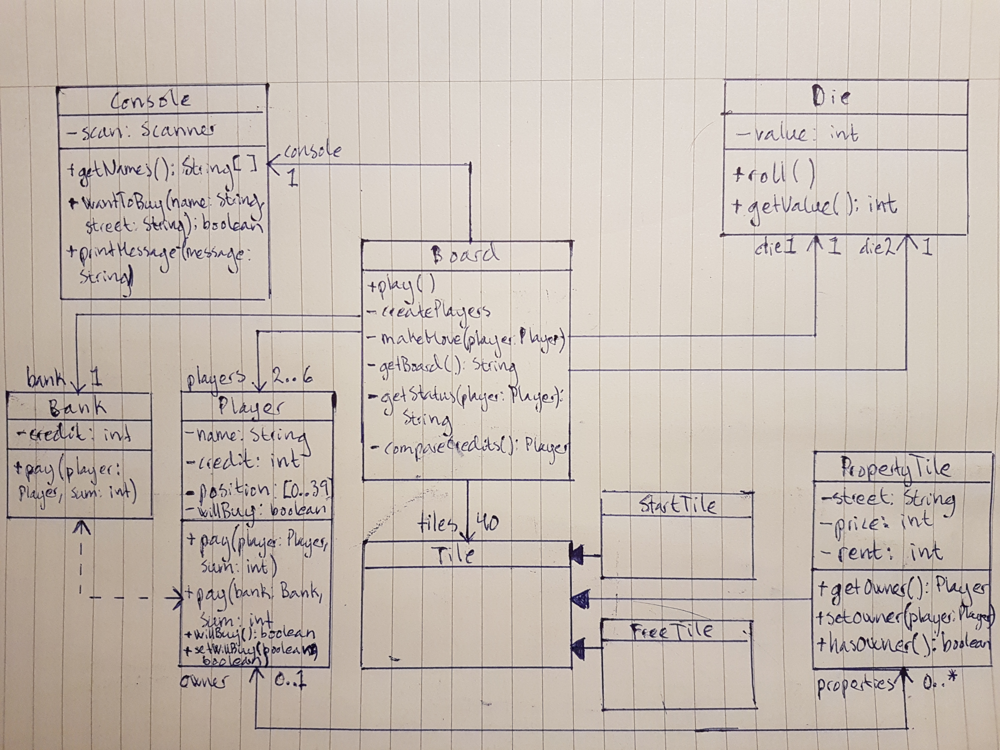
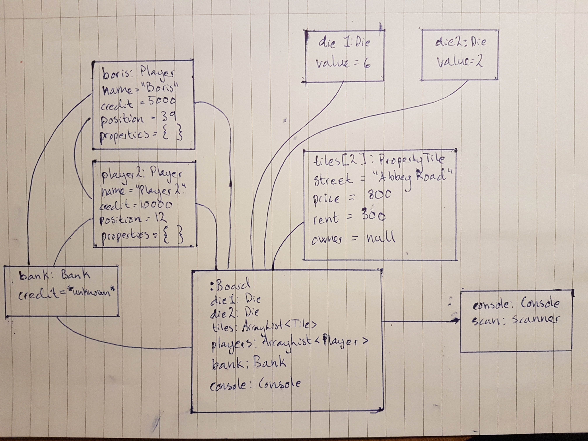
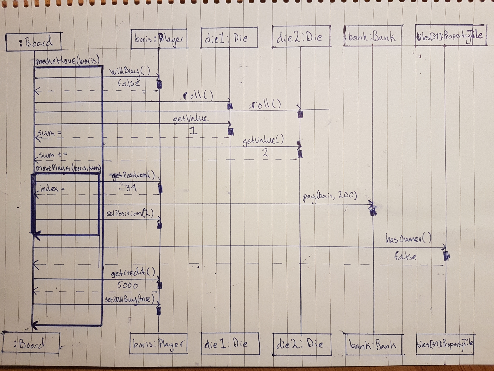

# The Indeded Desing
This is where you add your intended object oriente design.

## Class diagram
Kommentar: Jag har inte skrivit ut alla getters och setters i klassdiagrammet då det tog för mycket plats. Dependency-relationen mellan Bank och Player utgörs av att den ena anropar den andra i sin pay()-metod. StartTile och FreeTile är lämnade tomma för att i ett senare scenario kunna fyllas på med egenskaper och metoder. Det kändes logiskt att StartTile, FreeTile och PropertyTile skulle ärva från en superklass, men eftersom StartTile och FreeTile är tomma i dagsläget är jag medveten om att det ser konstigt ut...

## Object diagram
Tanken är att pgrogrammet ska acceptera 2-6 spelare. För att exemplifiera att det finns fler än en spelare i detta scenario har jag ritat ut ett andra Player-objekt utöver det som representear Boris.

## Sequence diagram

